# CuratorAI MVP - System Architecture Documentation

**Version 1.0 | October 2025**  
**Project:** CuratorAI Fashion Recommendation Platform  
**Client:** K&O Curator Technologies Group Ltd.  
**Developer:** Sumic IT Solutions Ltd.

---

## Table of Contents
1. [Executive Summary](#executive-summary)
2. [System Overview](#system-overview)
3. [Architecture Layers](#architecture-layers)
4. [Technology Stack](#technology-stack)
5. [Frontend Architecture](#frontend-architecture)
6. [Backend Architecture](#backend-architecture)
7. [AI/ML Architecture](#aiml-architecture)
8. [Database Architecture](#database-architecture)
9. [Cloud Infrastructure](#cloud-infrastructure)
10. [Security Architecture](#security-architecture)
11. [API Design](#api-design)
12. [Deployment Strategy](#deployment-strategy)
13. [Monitoring & Observability](#monitoring--observability)
14. [Performance Requirements](#performance-requirements)
15. [Disaster Recovery](#disaster-recovery)

---

## Executive Summary

CuratorAI is an AI-powered fashion recommendation platform that combines computer vision, machine learning, and virtual try-on technologies to deliver personalized outfit recommendations. The system is designed for scalability, handling 10,000+ concurrent users with sub-200ms response times.

### Key Features
- AI-powered outfit recommendations
- Virtual try-on using AR/Computer Vision
- Visual search for similar outfits
- Wardrobe tracking and management
- Social feed with shoppable lookbooks
- Comprehensive admin dashboard

### Technical Highlights
- **Stack**: React.js, Node.js, MongoDB, TensorFlow
- **Cloud**: AWS Multi-region architecture
- **Performance**: <200ms API response, <500ms ML inference
- **Scale**: 10,000 concurrent users, 5,000 RPS
- **Cost**: $4,700-7,000/month estimated

---

## System Overview

### High-Level Architecture

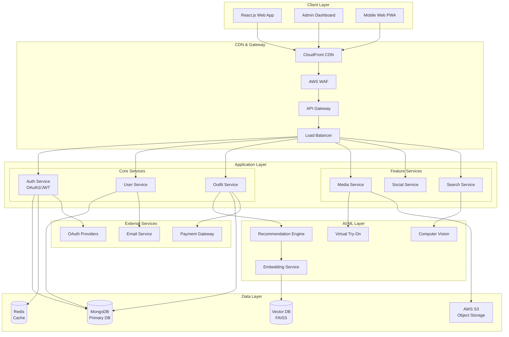
```mermaid
graph TB
    subgraph "Client Layer"
        WEB[React.js Web App]
        ADMIN[Admin Dashboard]
        MOBILE[Mobile Web PWA]
    end
    
    subgraph "CDN & Gateway"
        CF[CloudFront CDN]
        WAF[AWS WAF]
        APIGW[API Gateway]
        LB[Load Balancer]
    end
    
    subgraph "Application Layer"
        subgraph "Core Services"
            AUTH[Auth Service<br/>OAuth2/JWT]
            USER[User Service]
            OUTFIT[Outfit Service]
        end
        
        subgraph "Feature Services"
            MEDIA[Media Service]
            SOCIAL[Social Service]
            SEARCH[Search Service]
        end
    end
    
    subgraph "AI/ML Layer"
        REC[Recommendation Engine]
        VISION[Computer Vision]
        TRYON[Virtual Try-On]
        EMBED[Embedding Service]
    end
    
    subgraph "Data Layer"
        MONGO[(MongoDB<br/>Primary DB)]
        REDIS[(Redis<br/>Cache)]
        S3[AWS S3<br/>Object Storage]
        VECTOR[(Vector DB<br/>FAISS)]
    end
    
    subgraph "External Services"
        OAUTH[OAuth Providers]
        EMAIL[Email Service]
        PAYMENT[Payment Gateway]
    end
    
    WEB --> CF
    ADMIN --> CF
    MOBILE --> CF
    
    CF --> WAF
    WAF --> APIGW
    APIGW --> LB
    
    LB --> AUTH
    LB --> USER
    LB --> OUTFIT
    LB --> MEDIA
    LB --> SOCIAL
    LB --> SEARCH
    
    OUTFIT --> REC
    SEARCH --> VISION
    MEDIA --> TRYON
    REC --> EMBED
    
    AUTH --> MONGO
    USER --> MONGO
    OUTFIT --> MONGO
    AUTH --> REDIS
    MEDIA --> S3
    EMBED --> VECTOR
    
    AUTH --> OAUTH
    USER --> EMAIL
    OUTFIT --> PAYMENT
```

### Request Flow

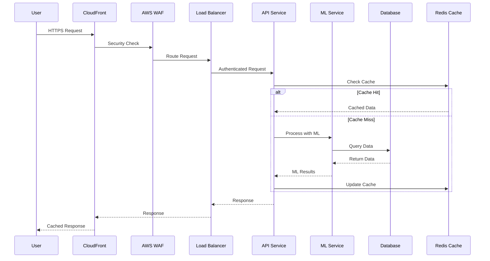
```mermaid
sequenceDiagram
    participant U as User
    participant CF as CloudFront
    participant WAF as AWS WAF
    participant ALB as Load Balancer
    participant API as API Service
    participant ML as ML Service
    participant DB as Database
    participant Cache as Redis Cache
    
    U->>CF: HTTPS Request
    CF->>WAF: Security Check
    WAF->>ALB: Route Request
    ALB->>API: Authenticated Request
    API->>Cache: Check Cache
    
    alt Cache Hit
        Cache-->>API: Cached Data
    else Cache Miss
        API->>ML: Process with ML
        ML->>DB: Query Data
        DB-->>ML: Return Data
        ML-->>API: ML Results
        API->>Cache: Update Cache
    end
    
    API-->>ALB: Response
    ALB-->>CF: Response
    CF-->>U: Cached Response
```

---

## Architecture Layers

### System Layers Overview

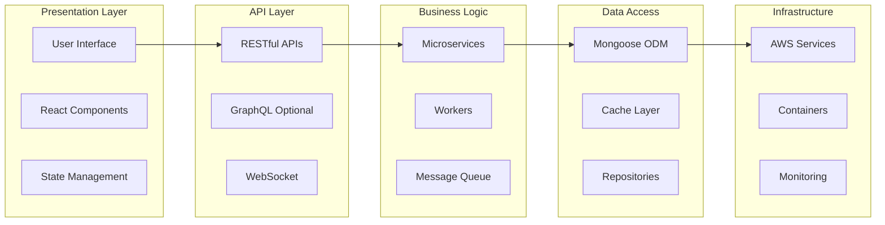
```mermaid
graph LR
    subgraph "Presentation Layer"
        UI[User Interface]
        COMP[React Components]
        STATE[State Management]
    end
    
    subgraph "API Layer"
        REST[RESTful APIs]
        GQL[GraphQL Optional]
        WS[WebSocket]
    end
    
    subgraph "Business Logic"
        SVC[Microservices]
        WORK[Workers]
        QUEUE[Message Queue]
    end
    
    subgraph "Data Access"
        ORM[Mongoose ODM]
        CACHE[Cache Layer]
        REPO[Repositories]
    end
    
    subgraph "Infrastructure"
        CLOUD[AWS Services]
        CONT[Containers]
        MON[Monitoring]
    end
    
    UI --> REST
    REST --> SVC
    SVC --> ORM
    ORM --> CLOUD
```

### Layer Responsibilities

| Layer | Responsibility | Technologies |
|-------|---------------|--------------|
| **Presentation** | User interface, interactions | React, Redux, Material-UI |
| **API Gateway** | Routing, rate limiting, auth | Express, Nginx |
| **Application** | Business logic, processing | Node.js, Express |
| **AI/ML** | Intelligence, recommendations | TensorFlow, Python |
| **Data** | Persistence, caching | MongoDB, Redis |
| **Infrastructure** | Cloud resources, scaling | AWS, Docker, K8s |

---

## Technology Stack

### Core Technologies

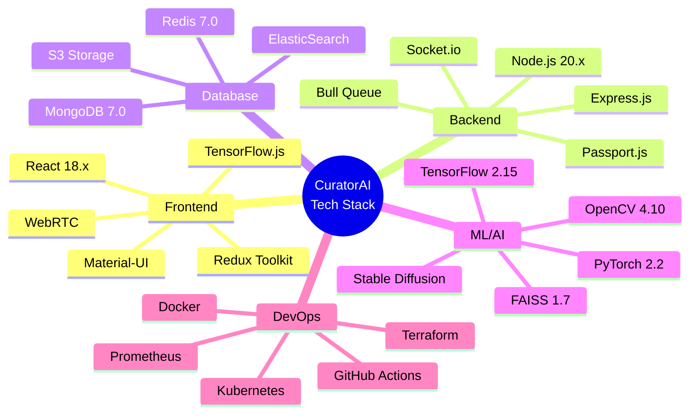
```mermaid
mindmap
  root((CuratorAI<br/>Tech Stack))
    Frontend
      React 18.x
      Redux Toolkit
      Material-UI
      TensorFlow.js
      WebRTC
    Backend
      Node.js 20.x
      Express.js
      Socket.io
      Passport.js
      Bull Queue
    Database
      MongoDB 7.0
      Redis 7.0
      ElasticSearch
      S3 Storage
    ML/AI
      TensorFlow 2.15
      PyTorch 2.2
      OpenCV 4.10
      FAISS 1.7
      Stable Diffusion
    DevOps
      Docker
      Kubernetes
      GitHub Actions
      Terraform
      Prometheus
```

### Technology Decision Matrix

| Component | Technology | Alternative | Rationale |
|-----------|------------|-------------|-----------|
| **Frontend Framework** | React.js | Vue.js, Angular | Team expertise, ecosystem |
| **Backend Runtime** | Node.js | Python, Go | JavaScript consistency |
| **Primary Database** | MongoDB | PostgreSQL | Flexibility for schema evolution |
| **Cache Layer** | Redis | Memcached | Persistence, data structures |
| **ML Framework** | TensorFlow | PyTorch | Production maturity |
| **Container Platform** | Docker | Podman | Industry standard |
| **Orchestration** | ECS | Kubernetes | AWS integration |
| **CI/CD** | GitHub Actions | Jenkins | GitHub integration |

---

## Frontend Architecture

### Component Architecture

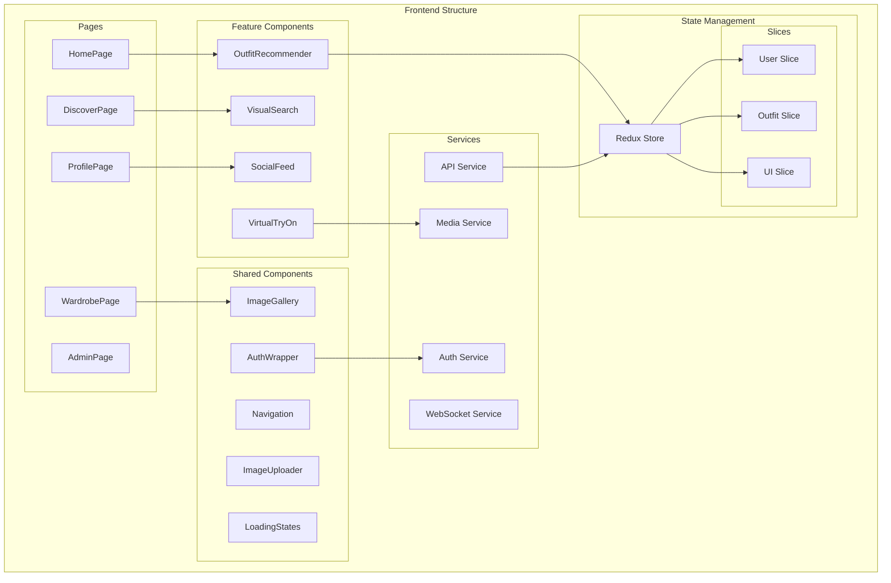
```mermaid
graph TD
    subgraph "Frontend Structure"
        subgraph "Pages"
            HOME[HomePage]
            PROFILE[ProfilePage]
            WARDROBE[WardrobePage]
            DISCOVER[DiscoverPage]
            ADMIN_PAGE[AdminPage]
        end
        
        subgraph "Feature Components"
            OUTFIT_REC[OutfitRecommender]
            VIRTUAL[VirtualTryOn]
            VISUAL_SEARCH[VisualSearch]
            SOCIAL_FEED[SocialFeed]
        end
        
        subgraph "Shared Components"
            NAV[Navigation]
            AUTH_COMP[AuthWrapper]
            UPLOAD[ImageUploader]
            GALLERY[ImageGallery]
            LOADER[LoadingStates]
        end
        
        subgraph "State Management"
            STORE[Redux Store]
            subgraph "Slices"
                USER_STATE[User Slice]
                OUTFIT_STATE[Outfit Slice]
                UI_STATE[UI Slice]
            end
        end
        
        subgraph "Services"
            API_SVC[API Service]
            AUTH_SVC[Auth Service]
            MEDIA_SVC[Media Service]
            WS_SVC[WebSocket Service]
        end
    end
    
    HOME --> OUTFIT_REC
    DISCOVER --> VISUAL_SEARCH
    WARDROBE --> GALLERY
    PROFILE --> SOCIAL_FEED
    
    OUTFIT_REC --> STORE
    VIRTUAL --> MEDIA_SVC
    AUTH_COMP --> AUTH_SVC
    
    STORE --> USER_STATE
    STORE --> OUTFIT_STATE
    STORE --> UI_STATE
    
    API_SVC --> STORE
```

### Frontend File Structure

```
frontend/
├── public/
│   ├── index.html
│   └── manifest.json
├── src/
│   ├── components/
│   │   ├── common/
│   │   │   ├── Button/
│   │   │   ├── Modal/
│   │   │   └── Form/
│   │   ├── outfit/
│   │   │   ├── OutfitCard/
│   │   │   ├── OutfitGrid/
│   │   │   └── Recommender/
│   │   ├── wardrobe/
│   │   │   ├── WardrobeItem/
│   │   │   └── CategoryFilter/
│   │   └── tryon/
│   │       ├── Camera/
│   │       └── AROverlay/
│   ├── pages/
│   │   ├── Home/
│   │   ├── Profile/
│   │   └── Admin/
│   ├── services/
│   │   ├── api.js
│   │   ├── auth.js
│   │   └── websocket.js
│   ├── store/
│   │   ├── index.js
│   │   └── slices/
│   ├── hooks/
│   │   ├── useAuth.js
│   │   └── useOutfit.js
│   └── utils/
│       ├── constants.js
│       └── helpers.js
```

---

## Backend Architecture

### Microservices Architecture

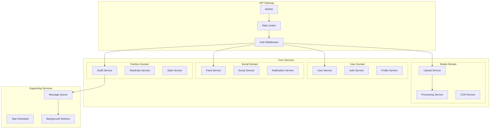
```mermaid
graph TB
    subgraph "API Gateway"
        NGINX[NGINX]
        RATE[Rate Limiter]
        AUTH_MW[Auth Middleware]
    end
    
    subgraph "Core Services"
        subgraph "User Domain"
            USER_SVC[User Service]
            AUTH_SVC[Auth Service]
            PROFILE_SVC[Profile Service]
        end
        
        subgraph "Fashion Domain"
            OUTFIT_SVC[Outfit Service]
            WARDROBE_SVC[Wardrobe Service]
            STYLE_SVC[Style Service]
        end
        
        subgraph "Social Domain"
            FEED_SVC[Feed Service]
            SOCIAL_SVC[Social Service]
            NOTIF_SVC[Notification Service]
        end
        
        subgraph "Media Domain"
            UPLOAD_SVC[Upload Service]
            PROCESS_SVC[Processing Service]
            CDN_SVC[CDN Service]
        end
    end
    
    subgraph "Supporting Services"
        QUEUE[Message Queue]
        SCHEDULER[Task Scheduler]
        WORKER[Background Workers]
    end
    
    NGINX --> RATE
    RATE --> AUTH_MW
    AUTH_MW --> USER_SVC
    AUTH_MW --> OUTFIT_SVC
    AUTH_MW --> FEED_SVC
    AUTH_MW --> UPLOAD_SVC
    
    OUTFIT_SVC --> QUEUE
    UPLOAD_SVC --> PROCESS_SVC
    QUEUE --> WORKER
```

### Service Communication

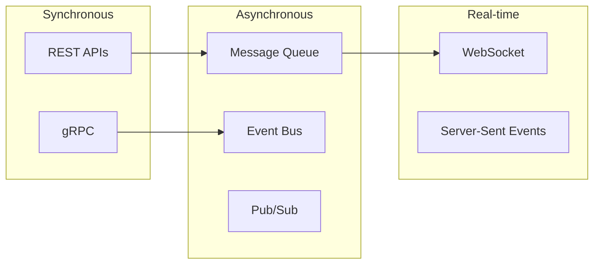
```mermaid
graph LR
    subgraph "Synchronous"
        REST[REST APIs]
        GRPC[gRPC]
    end
    
    subgraph "Asynchronous"
        MQ[Message Queue]
        EVENTS[Event Bus]
        PUBSUB[Pub/Sub]
    end
    
    subgraph "Real-time"
        WS[WebSocket]
        SSE[Server-Sent Events]
    end
    
    REST --> MQ
    GRPC --> EVENTS
    MQ --> WS
```

### API Endpoints Structure

```yaml
/api/v1:
  /auth:
    POST /register: User registration
    POST /login: User login
    POST /logout: User logout
    POST /refresh: Token refresh
    GET /profile: Get user profile
    
  /users:
    GET /{userId}: Get user details
    PUT /{userId}: Update user
    DELETE /{userId}: Delete user
    GET /{userId}/wardrobe: Get user wardrobe
    POST /{userId}/preferences: Update preferences
    
  /outfits:
    GET /recommendations: Get recommendations
    POST /generate: Generate outfit
    GET /{outfitId}: Get outfit details
    POST /{outfitId}/like: Like outfit
    POST /{outfitId}/save: Save outfit
    
  /wardrobe:
    GET /items: List wardrobe items
    POST /items: Add item
    PUT /items/{itemId}: Update item
    DELETE /items/{itemId}: Delete item
    POST /items/{itemId}/upload: Upload image
    
  /search:
    POST /visual: Visual search
    GET /similar/{imageId}: Find similar
    POST /filters: Search with filters
    
  /social:
    GET /feed: Get social feed
    POST /posts: Create post
    GET /posts/{postId}: Get post
    POST /posts/{postId}/comment: Add comment
    
  /admin:
    GET /dashboard: Dashboard data
    GET /analytics: Analytics
    GET /users: User management
    POST /content: Content management
```

---

## AI/ML Architecture

### ML Pipeline

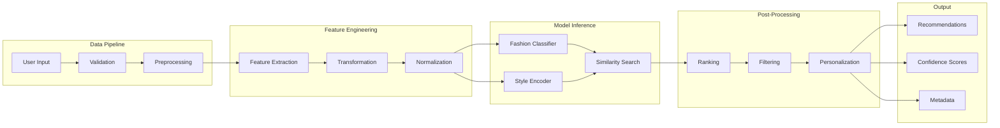
```mermaid
graph LR
    subgraph "Data Pipeline"
        INPUT[User Input]
        VALIDATE[Validation]
        PREPROCESS[Preprocessing]
    end
    
    subgraph "Feature Engineering"
        EXTRACT[Feature Extraction]
        TRANSFORM[Transformation]
        NORMALIZE[Normalization]
    end
    
    subgraph "Model Inference"
        FASHION[Fashion Classifier]
        STYLE[Style Encoder]
        SIMILARITY[Similarity Search]
    end
    
    subgraph "Post-Processing"
        RANK[Ranking]
        FILTER[Filtering]
        PERSONALIZE[Personalization]
    end
    
    subgraph "Output"
        RECOMMEND[Recommendations]
        CONFIDENCE[Confidence Scores]
        METADATA[Metadata]
    end
    
    INPUT --> VALIDATE
    VALIDATE --> PREPROCESS
    PREPROCESS --> EXTRACT
    EXTRACT --> TRANSFORM
    TRANSFORM --> NORMALIZE
    
    NORMALIZE --> FASHION
    NORMALIZE --> STYLE
    FASHION --> SIMILARITY
    STYLE --> SIMILARITY
    
    SIMILARITY --> RANK
    RANK --> FILTER
    FILTER --> PERSONALIZE
    
    PERSONALIZE --> RECOMMEND
    PERSONALIZE --> CONFIDENCE
    PERSONALIZE --> METADATA
```

### Model Components

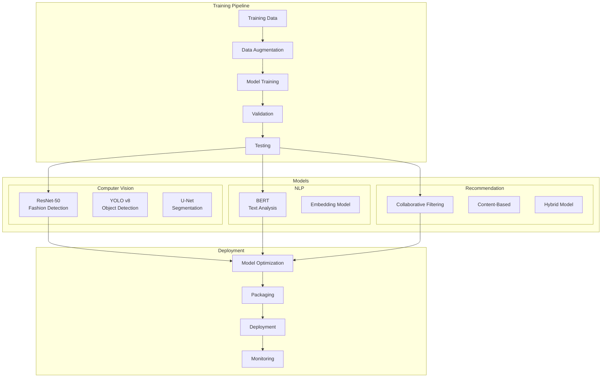
```mermaid
graph TB
    subgraph "Training Pipeline"
        DATA[Training Data]
        AUG[Data Augmentation]
        TRAIN[Model Training]
        VAL[Validation]
        TEST[Testing]
    end
    
    subgraph "Models"
        subgraph "Computer Vision"
            RESNET[ResNet-50<br/>Fashion Detection]
            YOLO[YOLO v8<br/>Object Detection]
            UNET[U-Net<br/>Segmentation]
        end
        
        subgraph "NLP"
            BERT[BERT<br/>Text Analysis]
            EMBED_MODEL[Embedding Model]
        end
        
        subgraph "Recommendation"
            CF[Collaborative Filtering]
            CB[Content-Based]
            HYBRID[Hybrid Model]
        end
    end
    
    subgraph "Deployment"
        OPTIMIZE[Model Optimization]
        PACKAGE[Packaging]
        DEPLOY[Deployment]
        MONITOR[Monitoring]
    end
    
    DATA --> AUG
    AUG --> TRAIN
    TRAIN --> VAL
    VAL --> TEST
    
    TEST --> RESNET
    TEST --> BERT
    TEST --> CF
    
    RESNET --> OPTIMIZE
    BERT --> OPTIMIZE
    CF --> OPTIMIZE
    
    OPTIMIZE --> PACKAGE
    PACKAGE --> DEPLOY
    DEPLOY --> MONITOR
```

### Virtual Try-On Architecture

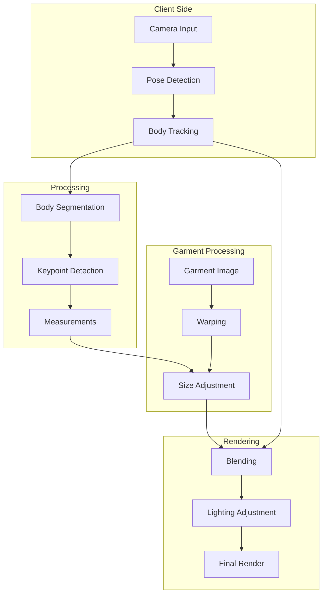
```mermaid
graph TD
    subgraph "Client Side"
        CAMERA[Camera Input]
        POSE[Pose Detection]
        TRACK[Body Tracking]
    end
    
    subgraph "Processing"
        SEG[Body Segmentation]
        KEYPOINT[Keypoint Detection]
        MEASURE[Measurements]
    end
    
    subgraph "Garment Processing"
        GARMENT[Garment Image]
        WARP[Warping]
        ADJUST[Size Adjustment]
    end
    
    subgraph "Rendering"
        BLEND[Blending]
        LIGHT[Lighting Adjustment]
        RENDER[Final Render]
    end
    
    CAMERA --> POSE
    POSE --> TRACK
    TRACK --> SEG
    SEG --> KEYPOINT
    KEYPOINT --> MEASURE
    
    GARMENT --> WARP
    MEASURE --> ADJUST
    WARP --> ADJUST
    
    ADJUST --> BLEND
    TRACK --> BLEND
    BLEND --> LIGHT
    LIGHT --> RENDER
```

---

## Database Architecture

### Database Schema

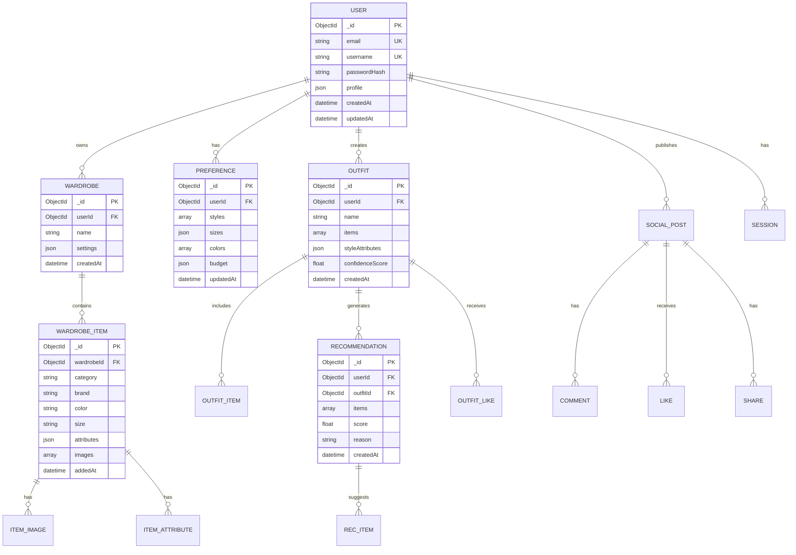
```mermaid
erDiagram
    USER ||--o{ WARDROBE : owns
    USER ||--o{ PREFERENCE : has
    USER ||--o{ OUTFIT : creates
    USER ||--o{ SOCIAL_POST : publishes
    USER ||--o{ SESSION : has
    
    WARDROBE ||--o{ WARDROBE_ITEM : contains
    WARDROBE_ITEM ||--o{ ITEM_IMAGE : has
    WARDROBE_ITEM ||--o{ ITEM_ATTRIBUTE : has
    
    OUTFIT ||--o{ OUTFIT_ITEM : includes
    OUTFIT ||--o{ RECOMMENDATION : generates
    OUTFIT ||--o{ OUTFIT_LIKE : receives
    
    SOCIAL_POST ||--o{ COMMENT : has
    SOCIAL_POST ||--o{ LIKE : receives
    SOCIAL_POST ||--o{ SHARE : has
    
    RECOMMENDATION ||--o{ REC_ITEM : suggests
    
    USER {
        ObjectId _id PK
        string email UK
        string username UK
        string passwordHash
        json profile
        datetime createdAt
        datetime updatedAt
    }
    
    WARDROBE {
        ObjectId _id PK
        ObjectId userId FK
        string name
        json settings
        datetime createdAt
    }
    
    WARDROBE_ITEM {
        ObjectId _id PK
        ObjectId wardrobeId FK
        string category
        string brand
        string color
        string size
        json attributes
        array images
        datetime addedAt
    }
    
    OUTFIT {
        ObjectId _id PK
        ObjectId userId FK
        string name
        array items
        json styleAttributes
        float confidenceScore
        datetime createdAt
    }
    
    PREFERENCE {
        ObjectId _id PK
        ObjectId userId FK
        array styles
        json sizes
        array colors
        json budget
        datetime updatedAt
    }
    
    RECOMMENDATION {
        ObjectId _id PK
        ObjectId userId FK
        ObjectId outfitId FK
        array items
        float score
        string reason
        datetime createdAt
    }
```

### Data Storage Strategy

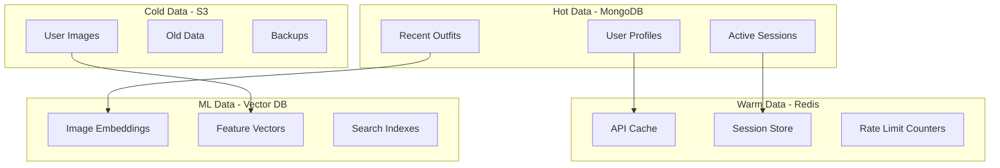
```mermaid
graph TB
    subgraph "Hot Data - MongoDB"
        USER_DATA[User Profiles]
        SESSION_DATA[Active Sessions]
        RECENT_OUTFITS[Recent Outfits]
    end
    
    subgraph "Warm Data - Redis"
        CACHE[API Cache]
        SESSION_STORE[Session Store]
        RATE_LIMIT[Rate Limit Counters]
    end
    
    subgraph "Cold Data - S3"
        IMAGES[User Images]
        ARCHIVES[Old Data]
        BACKUPS[Backups]
    end
    
    subgraph "ML Data - Vector DB"
        EMBEDDINGS[Image Embeddings]
        FEATURES[Feature Vectors]
        INDEXES[Search Indexes]
    end
    
    USER_DATA --> CACHE
    SESSION_DATA --> SESSION_STORE
    RECENT_OUTFITS --> EMBEDDINGS
    IMAGES --> FEATURES
```

---

## Cloud Infrastructure

### AWS Architecture

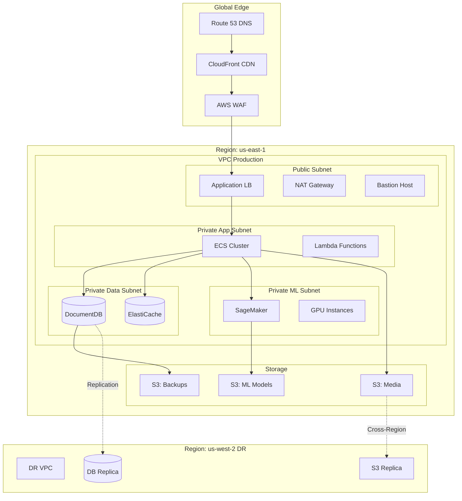
```mermaid
graph TB
    subgraph "Global Edge"
        R53[Route 53 DNS]
        CF[CloudFront CDN]
        WAF_EDGE[AWS WAF]
    end
    
    subgraph "Region: us-east-1"
        subgraph "VPC Production"
            subgraph "Public Subnet"
                ALB[Application LB]
                NAT[NAT Gateway]
                BASTION[Bastion Host]
            end
            
            subgraph "Private App Subnet"
                ECS[ECS Cluster]
                LAMBDA[Lambda Functions]
            end
            
            subgraph "Private Data Subnet"
                RDS[(DocumentDB)]
                REDIS[(ElastiCache)]
            end
            
            subgraph "Private ML Subnet"
                SAGEMAKER[SageMaker]
                GPU[GPU Instances]
            end
        end
        
        subgraph "Storage"
            S3_MEDIA[S3: Media]
            S3_MODELS[S3: ML Models]
            S3_BACKUP[S3: Backups]
        end
    end
    
    subgraph "Region: us-west-2 DR"
        DR_VPC[DR VPC]
        DR_DB[(DB Replica)]
        DR_S3[S3 Replica]
    end
    
    R53 --> CF
    CF --> WAF_EDGE
    WAF_EDGE --> ALB
    
    ALB --> ECS
    ECS --> RDS
    ECS --> REDIS
    ECS --> SAGEMAKER
    
    ECS --> S3_MEDIA
    SAGEMAKER --> S3_MODELS
    RDS --> S3_BACKUP
    
    RDS -.->|Replication| DR_DB
    S3_MEDIA -.->|Cross-Region| DR_S3
```

### Container Orchestration

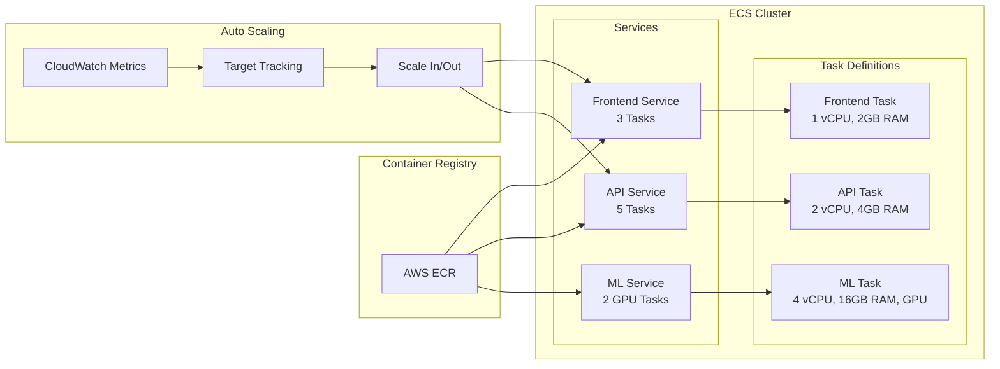
```mermaid
graph LR
    subgraph "Container Registry"
        ECR[AWS ECR]
    end
    
    subgraph "ECS Cluster"
        subgraph "Services"
            FE_SERVICE[Frontend Service<br/>3 Tasks]
            API_SERVICE[API Service<br/>5 Tasks]
            ML_SERVICE[ML Service<br/>2 GPU Tasks]
        end
        
        subgraph "Task Definitions"
            FE_TASK[Frontend Task<br/>1 vCPU, 2GB RAM]
            API_TASK[API Task<br/>2 vCPU, 4GB RAM]
            ML_TASK[ML Task<br/>4 vCPU, 16GB RAM, GPU]
        end
    end
    
    subgraph "Auto Scaling"
        TARGET[Target Tracking]
        METRIC[CloudWatch Metrics]
        SCALE[Scale In/Out]
    end
    
    ECR --> FE_SERVICE
    ECR --> API_SERVICE
    ECR --> ML_SERVICE
    
    FE_SERVICE --> FE_TASK
    API_SERVICE --> API_TASK
    ML_SERVICE --> ML_TASK
    
    METRIC --> TARGET
    TARGET --> SCALE
    SCALE --> FE_SERVICE
    SCALE --> API_SERVICE
```

---

## Security Architecture

### Security Layers

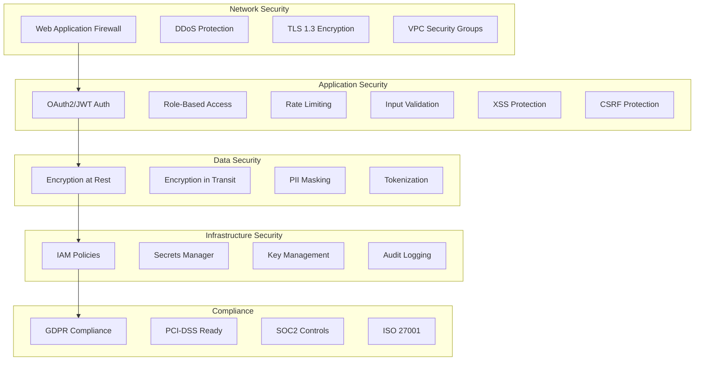
```mermaid
graph TD
    subgraph "Network Security"
        WAF[Web Application Firewall]
        DDOS[DDoS Protection]
        TLS[TLS 1.3 Encryption]
        VPC_SEC[VPC Security Groups]
    end
    
    subgraph "Application Security"
        AUTH_SEC[OAuth2/JWT Auth]
        RBAC[Role-Based Access]
        RATE_LIM[Rate Limiting]
        INPUT_VAL[Input Validation]
        XSS[XSS Protection]
        CSRF[CSRF Protection]
    end
    
    subgraph "Data Security"
        ENCRYPT_REST[Encryption at Rest]
        ENCRYPT_TRANSIT[Encryption in Transit]
        PII_MASK[PII Masking]
        TOKEN[Tokenization]
    end
    
    subgraph "Infrastructure Security"
        IAM[IAM Policies]
        SECRETS[Secrets Manager]
        KMS[Key Management]
        AUDIT[Audit Logging]
    end
    
    subgraph "Compliance"
        GDPR[GDPR Compliance]
        PCI[PCI-DSS Ready]
        SOC2[SOC2 Controls]
        ISO[ISO 27001]
    end
    
    WAF --> AUTH_SEC
    AUTH_SEC --> ENCRYPT_REST
    ENCRYPT_REST --> IAM
    IAM --> GDPR
```

### Authentication Flow

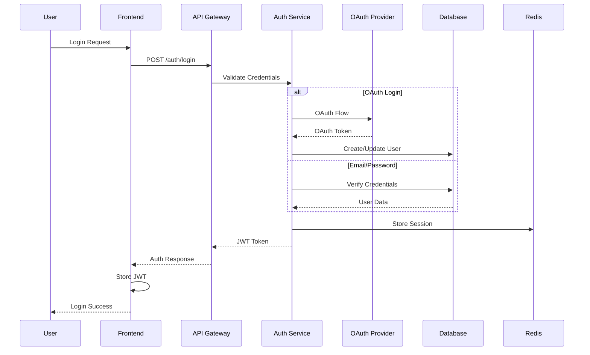
```mermaid
sequenceDiagram
    participant User
    participant Frontend
    participant API Gateway
    participant Auth Service
    participant OAuth Provider
    participant Database
    participant Redis
    
    User->>Frontend: Login Request
    Frontend->>API Gateway: POST /auth/login
    API Gateway->>Auth Service: Validate Credentials
    
    alt OAuth Login
        Auth Service->>OAuth Provider: OAuth Flow
        OAuth Provider-->>Auth Service: OAuth Token
        Auth Service->>Database: Create/Update User
    else Email/Password
        Auth Service->>Database: Verify Credentials
        Database-->>Auth Service: User Data
    end
    
    Auth Service->>Redis: Store Session
    Auth Service-->>API Gateway: JWT Token
    API Gateway-->>Frontend: Auth Response
    Frontend->>Frontend: Store JWT
    Frontend-->>User: Login Success
```

---

## API Design

### RESTful API Standards

```yaml
API Standards:
  Version: v1
  Base URL: https://api.curatorai.com/v1
  
  Authentication:
    Type: Bearer Token (JWT)
    Header: Authorization: Bearer {token}
    
  Response Format:
    Content-Type: application/json
    Structure:
      success:
        status: success
        data: object/array
        metadata:
          timestamp: ISO8601
          version: string
          pagination: object (if applicable)
      
      error:
        status: error
        error:
          code: string
          message: string
          details: object
        metadata:
          timestamp: ISO8601
          request_id: uuid
  
  Status Codes:
    200: OK
    201: Created
    204: No Content
    400: Bad Request
    401: Unauthorized
    403: Forbidden
    404: Not Found
    429: Too Many Requests
    500: Internal Server Error
    503: Service Unavailable
```

### API Rate Limiting

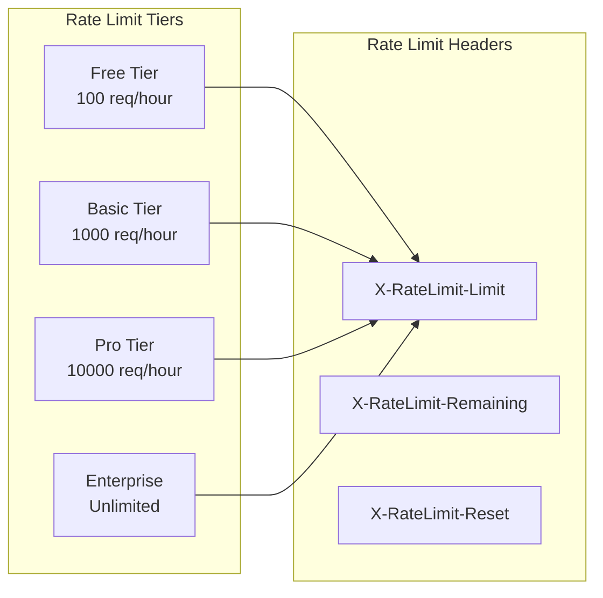
```mermaid
graph LR
    subgraph "Rate Limit Tiers"
        FREE[Free Tier<br/>100 req/hour]
        BASIC[Basic Tier<br/>1000 req/hour]
        PRO[Pro Tier<br/>10000 req/hour]
        ENTERPRISE[Enterprise<br/>Unlimited]
    end
    
    subgraph "Rate Limit Headers"
        LIMIT[X-RateLimit-Limit]
        REMAINING[X-RateLimit-Remaining]
        RESET[X-RateLimit-Reset]
    end
    
    FREE --> LIMIT
    BASIC --> LIMIT
    PRO --> LIMIT
    ENTERPRISE --> LIMIT
```

---

## Deployment Strategy

### CI/CD Pipeline


```mermaid
graph LR
    subgraph "Development"
        DEV[Feature Branch]
        PR[Pull Request]
        REVIEW[Code Review]
    end
    
    subgraph "CI Pipeline"
        BUILD[Build]
        LINT[Linting]
        UNIT[Unit Tests]
        INTEGRATION[Integration Tests]
        SECURITY[Security Scan]
    end
    
    subgraph "CD Pipeline"
        STAGING[Deploy Staging]
        E2E[E2E Tests]
        APPROVAL[Manual Approval]
        PROD[Deploy Production]
    end
    
    subgraph "Monitoring"
        HEALTH[Health Checks]
        METRICS[Metrics]
        ALERTS[Alerts]
        ROLLBACK[Auto Rollback]
    end
    
    DEV --> PR
    PR --> REVIEW
    REVIEW --> BUILD
    BUILD --> LINT
    LINT --> UNIT
    UNIT --> INTEGRATION
    INTEGRATION --> SECURITY
    
    SECURITY --> STAGING
    STAGING --> E2E
    E2E --> APPROVAL
    APPROVAL --> PROD
    
    PROD --> HEALTH
    HEALTH --> METRICS
    METRICS --> ALERTS
    ALERTS --> ROLLBACK
```

### Blue-Green Deployment

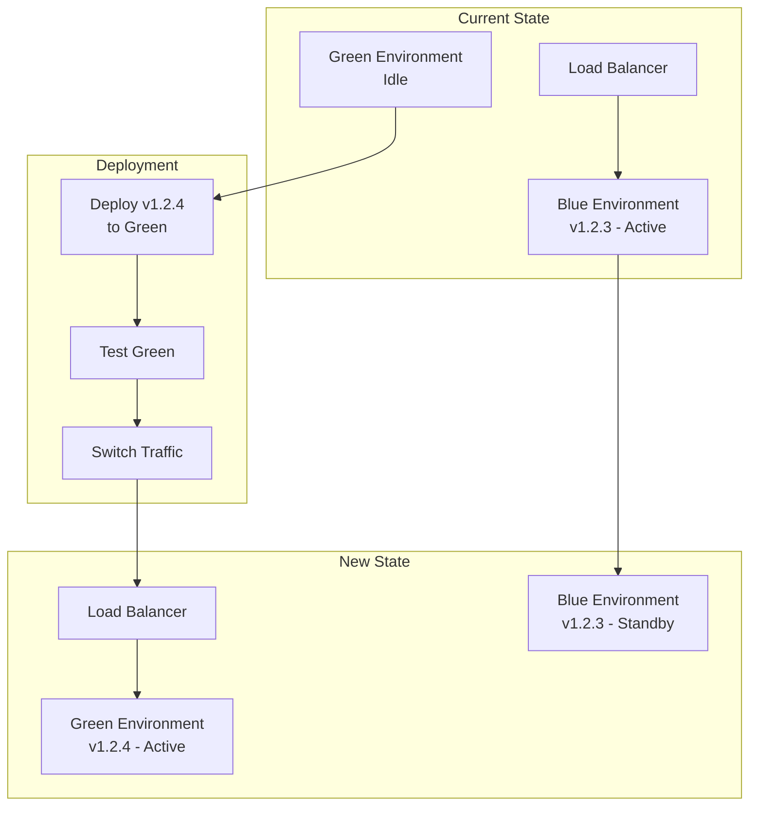
```mermaid
graph TB
    subgraph "Current State"
        LB_CURRENT[Load Balancer]
        BLUE_CURRENT[Blue Environment<br/>v1.2.3 - Active]
        GREEN_IDLE[Green Environment<br/>Idle]
    end
    
    subgraph "Deployment"
        DEPLOY_GREEN[Deploy v1.2.4<br/>to Green]
        TEST_GREEN[Test Green]
        SWITCH[Switch Traffic]
    end
    
    subgraph "New State"
        LB_NEW[Load Balancer]
        BLUE_IDLE_NEW[Blue Environment<br/>v1.2.3 - Standby]
        GREEN_ACTIVE[Green Environment<br/>v1.2.4 - Active]
    end
    
    LB_CURRENT --> BLUE_CURRENT
    GREEN_IDLE --> DEPLOY_GREEN
    DEPLOY_GREEN --> TEST_GREEN
    TEST_GREEN --> SWITCH
    SWITCH --> LB_NEW
    LB_NEW --> GREEN_ACTIVE
    BLUE_CURRENT --> BLUE_IDLE_NEW
```

---

## Monitoring & Observability

### Monitoring Stack

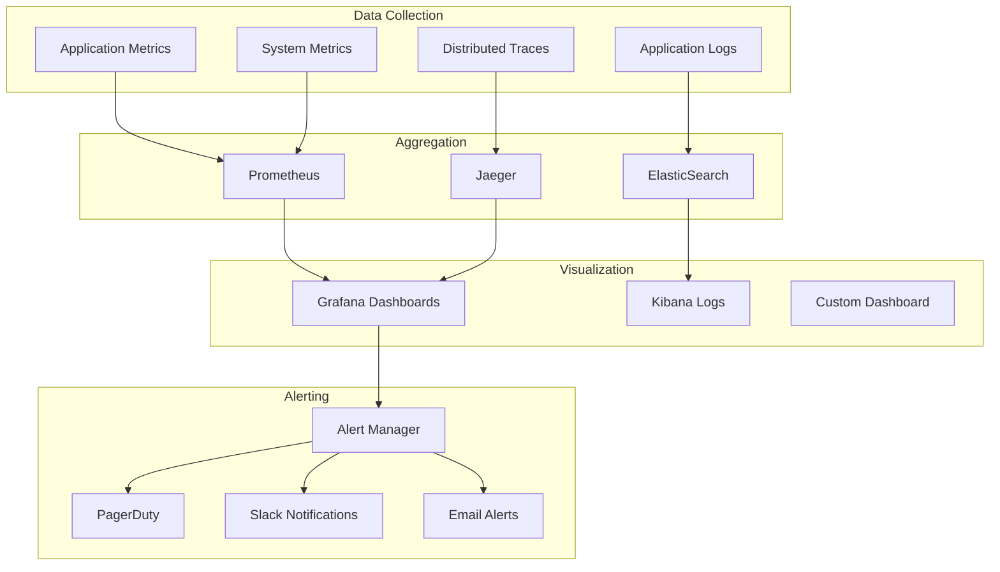
```mermaid
graph TD
    subgraph "Data Collection"
        APP_METRICS[Application Metrics]
        SYS_METRICS[System Metrics]
        LOGS[Application Logs]
        TRACES[Distributed Traces]
    end
    
    subgraph "Aggregation"
        PROMETHEUS[Prometheus]
        ELASTICSEARCH[ElasticSearch]
        JAEGER[Jaeger]
    end
    
    subgraph "Visualization"
        GRAFANA[Grafana Dashboards]
        KIBANA[Kibana Logs]
        CUSTOM[Custom Dashboard]
    end
    
    subgraph "Alerting"
        ALERT_MANAGER[Alert Manager]
        PAGERDUTY[PagerDuty]
        SLACK[Slack Notifications]
        EMAIL[Email Alerts]
    end
    
    APP_METRICS --> PROMETHEUS
    SYS_METRICS --> PROMETHEUS
    LOGS --> ELASTICSEARCH
    TRACES --> JAEGER
    
    PROMETHEUS --> GRAFANA
    ELASTICSEARCH --> KIBANA
    JAEGER --> GRAFANA
    
    GRAFANA --> ALERT_MANAGER
    ALERT_MANAGER --> PAGERDUTY
    ALERT_MANAGER --> SLACK
    ALERT_MANAGER --> EMAIL
```

### Key Performance Indicators

| Category | Metric | Target | Alert Threshold |
|----------|--------|--------|-----------------|
| **Availability** | Uptime | 99.9% | < 99.5% |
| **Performance** | API Response Time (p50) | < 100ms | > 150ms |
| | API Response Time (p95) | < 200ms | > 500ms |
| | API Response Time (p99) | < 500ms | > 1000ms |
| **Throughput** | Requests per Second | 5000 | < 1000 |
| **Error Rate** | 4xx Errors | < 2% | > 5% |
| | 5xx Errors | < 0.1% | > 1% |
| **ML Performance** | Model Accuracy | > 90% | < 85% |
| | Inference Time | < 500ms | > 1000ms |
| **Business Metrics** | Daily Active Users | 10,000 | < 5,000 |
| | Outfit Generation Rate | 500/hour | < 100/hour |

---

## Performance Requirements

### System Performance Targets

```mermaid
graph LR
    subgraph "Response Times"
        API[API: <200ms]
        WEB[Web: <2s]
        ML[ML: <500ms]
        UPLOAD[Upload: <3s]
    end
    
    subgraph "Capacity"
        USERS[10K Concurrent Users]
        RPS[5K Requests/Second]
        STORAGE[5TB Storage]
        BANDWIDTH[10TB/month]
    end
    
    subgraph "Availability"
        UPTIME[99.9% Uptime]
        RPO[RPO: 1 hour]
        RTO[RTO: 2 hours]
    end
```

### Performance Optimization Strategies

| Area | Strategy | Expected Improvement |
|------|----------|---------------------|
| **Frontend** | Code splitting, lazy loading | 40% faster load |
| **API** | Response caching, pagination | 60% latency reduction |
| **Database** | Indexing, query optimization | 50% faster queries |
| **ML Models** | Model quantization, caching | 70% inference speedup |
| **Infrastructure** | CDN, auto-scaling | 80% better response |

---

## Disaster Recovery

### DR Strategy

```mermaid
graph TB
    subgraph "Backup Strategy"
        CONTINUOUS[Continuous Backup]
        DAILY[Daily Snapshots]
        WEEKLY[Weekly Archives]
    end
    
    subgraph "Primary Region"
        PRIMARY_APP[Application]
        PRIMARY_DB[Database]
        PRIMARY_S3[Storage]
    end
    
    subgraph "DR Region"
        DR_APP[Standby Application]
        DR_DB[Database Replica]
        DR_S3[Storage Replica]
    end
    
    subgraph "Failover Process"
        DETECT[Failure Detection<br/>< 5 min]
        DECIDE[Decision<br/>< 10 min]
        SWITCH[DNS Switch<br/>< 15 min]
        VERIFY[Verification<br/>< 30 min]
    end
    
    PRIMARY_DB --> CONTINUOUS
    CONTINUOUS --> DR_DB
    
    PRIMARY_S3 --> DR_S3
    
    PRIMARY_APP --> DAILY
    DAILY --> DR_APP
    
    DETECT --> DECIDE
    DECIDE --> SWITCH
    SWITCH --> VERIFY
    
    VERIFY --> DR_APP
    VERIFY --> DR_DB
    VERIFY --> DR_S3
```

### Recovery Procedures

| Scenario | RPO | RTO | Procedure |
|----------|-----|-----|-----------|
| **Database Failure** | 1 hour | 30 min | Promote read replica |
| **Region Outage** | 1 hour | 2 hours | Failover to DR region |
| **Data Corruption** | 24 hours | 4 hours | Restore from backup |
| **Service Failure** | 0 | 5 min | Auto-scaling recovery |
| **Complete Disaster** | 24 hours | 4 hours | Full DR activation |

---

---

## Document Control

- **Version:** 1.0
- **Created:** October 1, 2025
- **Last Updated:** October 1, 2025
- **Author:** Team Lead, Sumic IT Solutions
- **Status:** Living Document
- **Review Cycle:** Bi-weekly during development

---